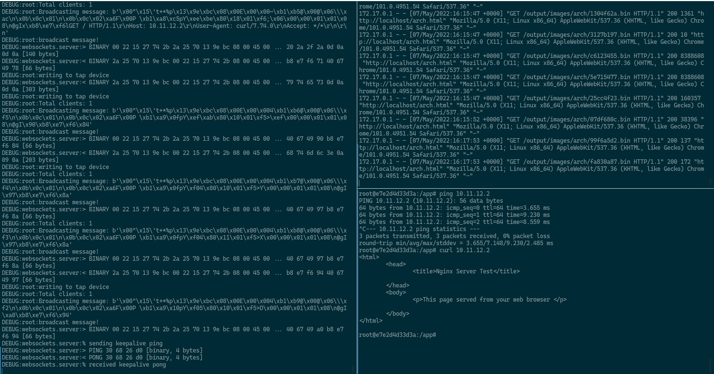

# tapws

## A simple virtual network interface over websocket

This project complements [V86](https://github.com/copy/v86) for its networking feature. Inspired by [WebSockets Proxy](https://github.com/benjamincburns/websockproxy)

## How to use

### Using Docker

#### Pre-built Docker image

- `docker pull pujianto/tapws`
- `docker run --rm -p 8080:8080 --privileged -it pujianto/tapws`

#### Local Build

- Clone this repository
- Run `docker build -t tapws .`
- Run `docker run --rm -p 8080:8080 --privileged tapws`

The docker image doesn't have dhcpd, so you need to set up your own network configuration.

For example, we run Archlinux inside a web browser.
you can run the following command on the "client side" (the one that run in the browser):

- `ip addr add 10.11.12.2/24 dev enp0s5`
- `ip link set enp0s5 up`

If you want to make your network accessible from the outside, you can run the following command on the **"client"** side:

- `ip route add default via 10.11.12.1 dev enp0s5`
- `echo "nameserver 1.1.1.1" >> /etc/resolv.conf`

Run these iptables commands from inside the tapws docker container:

- `iptables -A FORWARD -i eth0 -o tap0 -m state --state RELATED,ESTABLISHED -j ACCEPT`
- `iptables -A FORWARD -i tap0 -o eth0 -j ACCEPT`
- `iptables -t nat -A POSTROUTING -o eth0 -j MASQUERADE`

If your "client" side OS runs a service (e.g. sshd), you can forward the port to the tapws container.
For example, assuming you have sshd running on port 22 on the "client" side and want to forward it to the tapws container on port 2022, you can run the following command from inside the tapws container:

- `iptables -t nat -A PREROUTING -p tcp --dport 2022 -j DNAT --to-destination 10.11.12.2:22`
- `iptables -t nat -A POSTROUTING -p tcp -d 10.11.12.2 --dport 22 -j SNAT --to-source 10.11.12.1`

Now you should able to ssh to the "client" side from public side (laptop) using `ssh localhost -p 2022`

## Environment Variables

- `LOG_LEVEL`: set the log level, default is `ERROR`
- `HOST`: set the websocket listen host, , default is `0.0.0.0`
- `PORT`: set the websocket listen port, default is `8080`
- `WITH_SSL`: set to `true` to enable ssl, default is `false`
- `SSL_CERT`: set the ssl certificate file path, default is `/app/certs/fullchain.pem`
- `SSL_KEY`: set the ssl key file path, default is `/app/certs/privkey.pem`
- `SSL_PASSPHRASE`: set the ssl passphrase (private key's password), default is `None`

**Note:** If you want to test `wss://` protocol in local, consider to use [mkcert](https://github.com/FiloSottile/mkcert) instead of standard self-signed certificate.

### TODO

- Add iptables integration

### References

- https://github.com/copy/v86/blob/master/src/browser/network.js
- https://github.com/benjamincburns/websockproxy
