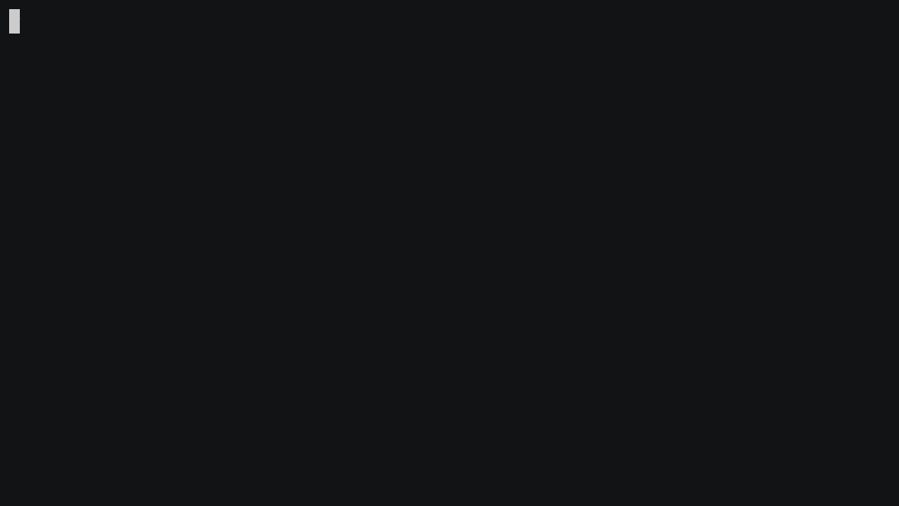

# tapws
version: 0.3.8

## A simple virtual network interface over websocket

This project listens to WebSocket connections and forwards the data to a virtual network interface in an ethernet frame format.
It has built-in DHCP server (enabled by default).

### Example usage

#### JSLinux

- Run tapws container. `docker run --pull=always --rm -p 8080:8080 --privileged -it pujianto/tapws`
- Open this emulator: https://bellard.org/jslinux/vm.html?url=alpine-x86.cfg&mem=192&net_url=ws://localhost:8080 on your browser.
- To test the internet connection, run `curl ipinfo.io` from the emulator

#### jor1k

- Run tapws container. `docker run --pull=always --rm -p 8080:8080 --privileged -it pujianto/tapws`
- Open this emulator: https://s-macke.github.io/jor1k/demos/main.html?user=PhFebTBhrE&cpu=asm&n=1&relayURL=ws%3A%2F%2Flocalhost%3A8080 on your browser.
- To test the internet connection, run `curl ipinfo.io` from the emulator

#### V86

- Run tapws container. `docker run --pull=always --rm -p 8080:8080 --privileged -it pujianto/tapws`
- Open https://copy.sh/v86
- Prepare a 32 bit OS image and mount it to CD drive or HDD Drive
- Set `ws://localhost:8080` as the Network proxy URL

### Environment Variables

- `LOG_LEVEL`: set the log level, default is `INFO`
- `HOST`: set the websocket listen host, , default is `0.0.0.0`
- `PORT`: set the websocket listen port, default is `8080`

- `WITH_SSL`: set to `true` to enable ssl, default is `false`
- `SSL_CERT`: set the ssl certificate file path, default is `/app/certs/fullchain.pem`
- `SSL_KEY`: set the ssl key file path, default is `/app/certs/privkey.pem`
- `SSL_PASSPHRASE`: set the ssl passphrase (private key's password), default is `None`

- `WITH_DHCP`: set to `true` to enable dhcp, default is `true`
- `INTERFACE_IP`: set the tap interface ip, default is `10.11.12.254`.
- `PUBLIC_INTERFACE`: set the public interface name,default is `None`. Dockerfile default is`eth0`. If `PUBLIC_INTERFACE` is `None`, the emulator can't access the internet (NAT not enabled).
- `INTERFACE_SUBNET`: set the tap interface subnet, default is `24`. Valid value `0` to `31`.
- `DHCP_LEASE_TIME`: set the dhcp lease time, default is `3600` (1 hour). Set to `-1` to make it infinite.

**Note:** If you want to run in `wss://` mode locally, consider to use [mkcert](https://github.com/FiloSottile/mkcert) instead of standard self-signed certificate.

### References

- https://github.com/copy/v86/blob/master/src/browser/network.js
- https://github.com/benjamincburns/websockproxy
